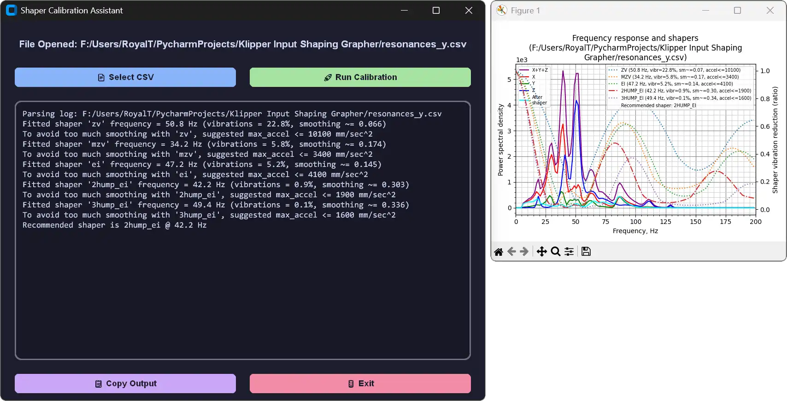

# Shaper Calibration Assistant

**A user-friendly desktop application for running Klipper's input shaper calibration.**

This tool provides a simple graphical user interface (GUI) for the powerful `calibrate_shaper.py` script, allowing users to analyze resonance data from their 3D printers without needing to interact with the command line or a full Klipper installation.




## ✨ Features

- **Modern, User-Friendly Interface:** A clean and intuitive GUI that's easy to navigate.
- **Responsive UI:** Background processing ensures the application remains responsive, even while analyzing large CSV files.
- **Detailed Analysis:** Generates the same high-quality frequency response graphs as the original Klipper script.
- **Simple to Use:** No complex setup or Python knowledge required. Just select your file and go.

## 🔌 Usage

1.  Download the latest release from the [Releases](https://github.com/theycallmek/Klipper-Input-Shaping-Assistant/releases) page.
2.  Run the executable. No installation is required.
3.  Click the **"Select CSV File"** button and choose the resonance data file (`.csv`) you want to analyze.
4.  Once a file is selected, the **"Run"** button will become active. Click it to start the calibration.
5.  The process will run in the background. Once complete, a graph will be displayed showing the frequency response and the recommended input shaper.

## 📦 Building from Source

If you want to build the application yourself, follow these steps:

1.  **Clone the repository:**
    ```bash
    git clone https://github.com/theycallmek/Klipper-Input-Shaping-Assistant.git
    cd Klipper-Input-Shaping-Assistant
    ```
2.  **Install dependencies:**
    Make sure you have Python installed. Then, install the required packages using pip:
    ```bash
    pip install -r requirements.txt
    ```
3.  **Run the application:**
    ```bash
    python main.py
    ```

4.  **Package into an executable (optional):**
    This project uses `pyinstaller` to create a single `.exe` file.
    ```bash
    pyinstaller main.py --onefile --windowed --add-data="extras/*;extras"
    ```

## 🤝 Contributing

Contributions are welcome! If you have ideas for new features, bug fixes, or improvements, please feel free to:

-   Open an issue to discuss the change.
-   Submit a pull request with your improvements.

We appreciate any and all contributions from the community!